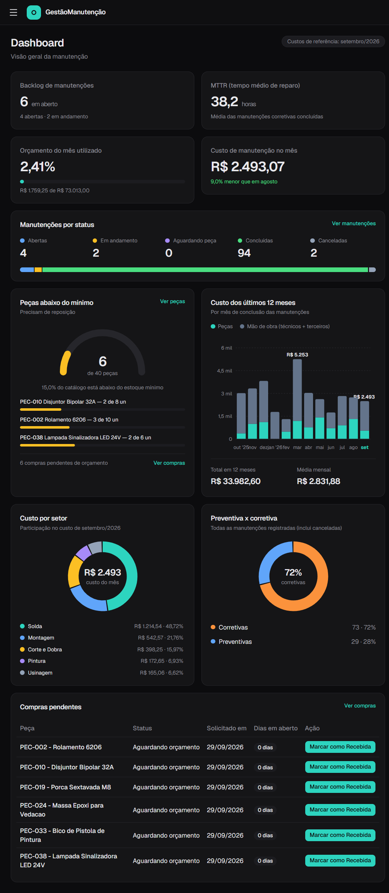

# GestãoManutenção — Frontend

[](https://github.com/Jcarvasousa/frontend-gestao-manutencao/actions/workflows/ci.yml)


Interface web do sistema de gestão de manutenção industrial (CMMS). Este repositório é o **frontend**. A API, as regras de negócio e a documentação completa do projeto estão em [gestao-manutencao-api](https://github.com/Jcarvasousa/gestao-manutencao-api).



## Demonstração ao vivo

| | |
|---|---|
| Aplicação | https://frontend-gestao-manutencao.vercel.app |
| Login de demonstração | usuário `demo` · senha `demo123` |

- A API roda em plano gratuito: **na primeira visita pode levar até 1 minuto para responder**. O Dashboard avisa quando isso acontece.
- Os dados são **fictícios e reiniciados todo dia às 2h (Brasília)**.
- Roteiro sugerido de 2 minutos: veja o [README do backend](https://github.com/Jcarvasousa/gestao-manutencao-api#roteiro-de-2-minutos).

## O que tem aqui

- **Dashboard** com indicadores (backlog, MTTR, orçamento do mês, custo do mês), manutenções por status, peças abaixo do mínimo, custo dos últimos 12 meses (barras empilhadas), custo por setor e preventiva × corretiva (roscas).
- **Painel de Detalhes da manutenção:** registrar uso de peça, devolver, vincular técnico com horas, registrar serviço de terceiro (valor total ou horas × valor/hora), editar o valor final, concluir e cancelar.
- **Relatórios de custo:** por várias máquinas (mistura de setores) e por setores, mensal, anual ou total acumulado, com download em PDF.
- **Cadastros:** máquinas, setores, peças, técnicos, compras e orçamentos, com filtros e busca.
- **Responsivo:** menu lateral que vira gaveta em telas menores e cards no lugar de tabelas quando falta espaço.


## Stack

React 18 · TypeScript · Vite 8 · Tailwind CSS v4 · shadcn/ui sobre Base UI · TanStack Query · React Router · Axios · Recharts

## Como rodar localmente

Pré-requisitos: **Node 22** e a [API](https://github.com/Jcarvasousa/gestao-manutencao-api) rodando (ou use a API de demonstração).

```bash
git clone https://github.com/Jcarvasousa/frontend-gestao-manutencao.git
cd frontend-gestao-manutencao
npm ci
npm run dev
```

Abre em `http://localhost:5173`. A URL da API vem da variável `VITE_API_URL`; sem ela, o padrão é `http://localhost:8080/api`. Para apontar para outra API, crie um arquivo `.env.local`:

```
VITE_API_URL=https://sua-api/api
```

Outros scripts: `npm run build` (checagem de tipos + build de produção) e `npm run lint`.

## Decisões técnicas

| Decisão | Por quê |
|---|---|
| **TanStack Query** com chaves por prefixo (`['manutencoes', …]`, `['pecas', …]`, `['relatorios', …]`) | Concluir ou cancelar uma manutenção invalida tudo o que depende dela, e o Dashboard atualiza sozinho. |
| Páginas carregadas sob demanda (`React.lazy`) | O Recharts fica fora do pacote principal. |
| **`ErrorBoundary`** por rota | Um erro de renderização, ou uma versão nova publicada com a aba aberta, mostra uma tela de recuperação em vez de uma página em branco. |
| Cada card do Dashboard busca e falha de forma independente | Um endpoint lento ou com erro não derruba a tela inteira. Os meses do gráfico que falham não viram zero em silêncio. |
| Seletores de peça, máquina e técnico com busca no servidor | O catálogo pode crescer; nada de carregar tudo de uma vez. |
| Tema escuro em tokens CSS (grafite + teal) | Toda a interface herda as cores da mesma fonte. |
| Gráfico de 12 meses com painel de detalhes por toque no celular | O toque é a única forma de ver o mês por extenso e os valores; o painel tem botão de fechar e não cobre as barras. |
| Formatação em pt-BR (`Intl`) | Moeda, percentuais e meses no formato do usuário. |

## Limitações declaradas

- **Não há testes automatizados no frontend.** O CI executa a checagem de tipos e o build (`tsc -b` e `npm run build`).
- O login é único (sem perfis de acesso), como na API.
- O gráfico do Dashboard faz uma chamada por mês (12), e o custo por setor é mais lento que os demais.
- O pacote do Dashboard tem cerca de 409 kB por causa do Recharts.
- Os PDFs são gerados pela API, não pelo navegador.

## Estrutura

```
src/
  api/          chamadas HTTP (uma função por endpoint)
  components/   componentes de negócio (diálogos, seletores, cards de relatório)
    dashboard/  cards e gráficos do Dashboard
    ui/         componentes base (shadcn/ui)
  context/      autenticação
  lib/          formatadores, meses, tratamento de erros, invalidação de cache
  pages/        uma página por rota
  types/        tipos e rótulos (o rótulo do usuário nunca é a constante do enum)
```

## CI

O workflow `ci.yml` roda a cada push e pull request na `main`: `npm ci`, checagem de tipos e build de produção. O deploy é feito pela Vercel.

## Autor

**João Vitor Carvalho de Sousa** — [github.com/Jcarvasousa](https://github.com/Jcarvasousa)
